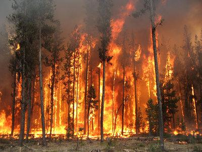
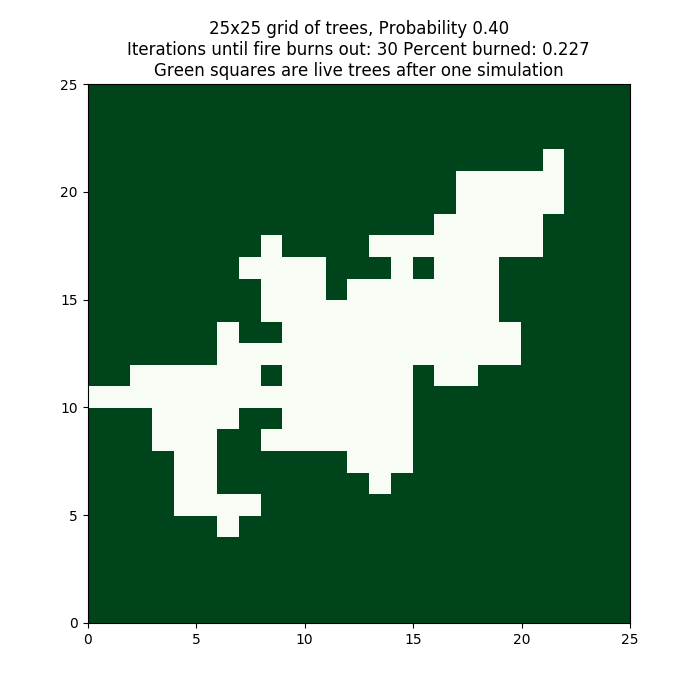
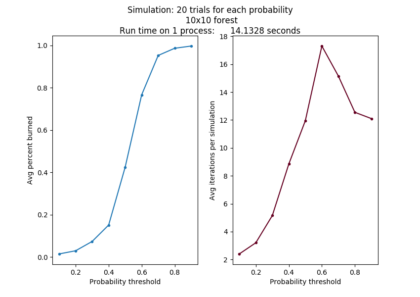
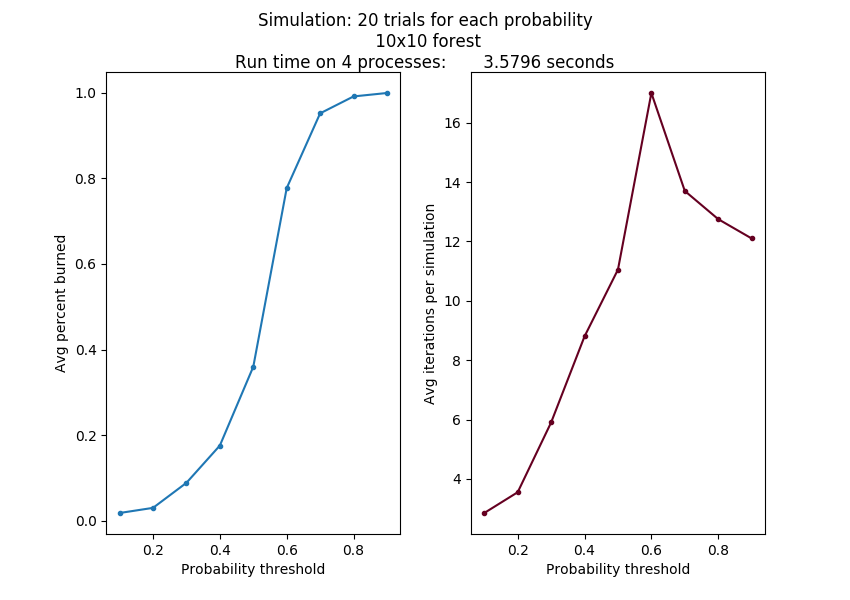
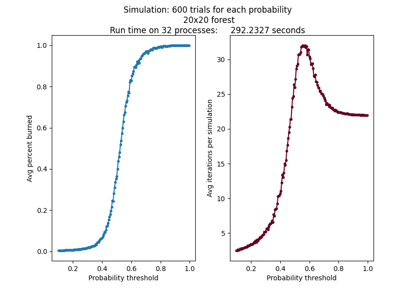

# Forest Fire Simulation Example

Ported to python from the original [Shodor foundation C code example](https://www.shodor.org/refdesk/Resources/Tutorials/BasicMPI/) by Libby Shoop (Macalester College).

**NOTE:** Please make sure that you have read the other instructions for using VNC and getting to a terminal window and navigating to the directory for the code for this exercise.



Forest fires can be devastating, causing damage to property and sometimes lives. Modeling fires using computation and statistics so that we can predict their spread is an ongoing research field that requires high performance computing.

Here we introduce the very simplest of these models so that you can get a sense for what is at the core of most fire simulation models.

According to the above Shodor page:

"you can run a single instance of a forest fire simulation in which a forest is modeled as an NxN grid of trees. One tree starts to smolder, and each iteration nearby trees have some chance of catching fire. The model follows the following rules:"

- Burning trees burn down.
- Smoldering trees catch fire.
- Unburnt trees next to (N, S, E, W) a burning tree catch fire with some random probability less than or equal to a given probability threshold.
- Repeat until fire burns out.

The main input parameters for the model are:

- The size, N of one row of trees in the NxN grid representing part of the forest.
- The upper limit of the chance of the fire spreading from a burning tree to a nearby unburnt tree.

The simulation starts with the tree in the center of the grid smoldering, and all other trees alive.

The main outputs for the single fire model are:

- The percentage of additional trees burned beyond the first tree.
- The number of iterations before the fire burns out.

## One fire on one process

The file `fire_sequential_once.py` contains a single simulation. You should have a look at it. One way is this: using the editor called gedit text editor in the Applications-Accessories menu of the VNC application connected to the virtual20 server, you can navigate to the CSinParallel/mpi4py-examples/fire folder and choose to open fire_sequential_once.py. (This will also apply to the other python code files that we mention below.)

The file `fire_sequential_once.py` uses functions in the file `fire_functions.py`. You don't need to dig down to that detail to start with, but you might want to study it further later. One point to note is that the function called `forest_burns` loops through every tree in the forest, updating its current state. How many times this is done until the forest is no longer burning can vary each time it is run and depends on the *prob_spread* input value.

 One single instance of this model can produce a different result each time it is run because of the randomness of the probability of unburnt trees catching fire. The code in `fire_sequential_once.py` creates a visualization of the run that looks like the following, with N = 25 and the probability threshold = 0.4.



Output like this can be obtained by running the single model in the terminal like this:

```sh
    python fire_sequential_once.py 25 0.4
```

Try running this several times at the same 0.4 threshold. Then try varying the threshold from 0.2 to 1.0 by 0.1 increments.

## Several trials at different probability thresholds

Each time the code is run, the result could be different.  In addition, even if we ran several trials, the resulting percent of trees burned and number of iterations before the fire burned out on average would be different, depending on the input probability threshold.  Because of this, a more realistic simulation requires that many instances of the above single simulation be run in this way:

- Keep the size of the grid of trees the same.
- Start with a low probability threshold.
- Run a given number of trials at a fixed probability threshold.
- Repeat for another probability threshold, some increment larger than the previous one, until the threshold is 1.0.

This simulation of multiple trials at a range of different probability thresholds has a known interesting output, which can be graphed as follows:



In this case, we ran 20 trials on a single Raspberry Pi 3B, with the probability threshold starting at 0.1 and incrementing by 0.1. We did this running the code file `fire_sequential_simulate.py` on a cluster head node  or server like this:

```sh
    python fire_sequential_simulate.py 10 0.1 20
```

Try this on the virtual20 cluster. Look at the code to see how there is a now loop for the number of trials and inside that loop is a loop over the various probability thresholds (along X axis of the figure produced.) It is the loop over the number of trials that we can decompose into separate processes using MPI below.

*Be patient here.* Notice if you increase the size of the forest by changing the 10 to 20, the time increases dramatically (much more than double). If you further increase the number of trials (the last parameter) from 20 to 30, like this:

```sh
    python fire_sequential_simulate.py 20 0.1 30
```

What happens to the time?

Hopefully you can see that increasing the size of the forest scales the time more than the number of trials.

As the size of the grid changes and the probability points increase, this curve will look roughly the same, although it should get smoother as the number of trials increases and the increment value is smaller. But these more accurate simulations take a long time to run.

## The parallel MPI version

The file for the MPI version is called `fire_mpi_simulate.py`. The patterns from the patternlets that are used in this version are:

- SPMD, Single program, multiple data
- master-worker
- broadcast
- parallel loop split into equal chunks
- message passing with send and receive

A useful exercise is to study the code and find which parts correspond to these patterns.

The desired outcome of the parallel version is to also produce a plot of average percent burns as a function of probability of spreading, as quickly and as accurately as possible. This should take into account that the probability of the fire spreading will affect not only how long it takes for the fire to burn out but also the number of iterations required to reached an accurate representation of the average.

If we put more processes to work on the problem, we should be able to complete a more accurate simulation in less time than the sequential version. Even the same problem as above produced the same results running on 4 processes on different nodes of a cluster in almost 1/4 of the time. Its output looks like this:



Now let's try our initial small forest of 10x10, with 20 trials, but splitting the trials among 4 processes. This can be run like this:

```sh
    mpirun -np 4 python fire_mpi_simulate.py 10 0.1 20
```

The parallelization happens by splitting up the number of trials to be run among the processes. Each process completes the range of probabilities for its portion of the trials, sending the results back to the master process.

### Try some other cases to observe how it scales


Ideally, as you double the number of workers on the same problem, the time should be cut in half. This is called **strong scalability**. But there is some overhead from the message passing, so we don't often see perfect strong scalability.

Try running these tests:

<style type="text/css">
.tg  {border-collapse:collapse;border-spacing:0;}
.tg td{font-family:Arial, sans-serif;font-size:14px;padding:10px 5px;border-style:solid;border-width:1px;overflow:hidden;word-break:normal;border-color:black;}
.tg th{font-family:Arial, sans-serif;font-size:14px;font-weight:normal;padding:10px 5px;border-style:solid;border-width:1px;overflow:hidden;word-break:normal;border-color:black;}
.tg .tg-0pky{border-color:inherit;text-align:left;vertical-align:top}
</style>
<table class="tg">
  <tr>
    <th class="tg-0pky">-np</th>
    <th class="tg-0pky">tree row size</th>
    <th class="tg-0pky">probability increment</th>
    <th class="tg-0pky">number of trials</th>
    <th class="tg-0pky">running time</th>
  </tr>
  <tr>
    <td class="tg-0pky">4</td>
    <td class="tg-0pky">20</td>
    <td class="tg-0pky">0.1</td>
    <td class="tg-0pky">40</td>
    <td class="tg-0pky"></td>
  </tr>
  <tr>
    <td class="tg-0pky">8</td>
    <td class="tg-0pky">20</td>
    <td class="tg-0pky">0.1</td>
    <td class="tg-0pky">40</td>
    <td class="tg-0pky"></td>
  </tr>
  <tr>
    <td class="tg-0pky">16</td>
    <td class="tg-0pky">20</td>
    <td class="tg-0pky">0.1</td>
    <td class="tg-0pky">40</td>
    <td class="tg-0pky"></td>
  </tr>
</table>

What do you observe about the time as you double the number of workers?

When does the message passing cause the most overhead, which adds to the running time?

When we have more work to do, things get better. Try this: increase the number of trials from 40 to 80, then start at 4 processes and double the number of processes in subsequent tries. With this situation, you should see that from 4 to 8 to 16 processes, the time is roughly halved. This demonstrates good scalability of the use of extra processors. This should be this table:

<style type="text/css">
.tg  {border-collapse:collapse;border-spacing:0;}
.tg td{font-family:Arial, sans-serif;font-size:14px;padding:10px 5px;border-style:solid;border-width:1px;overflow:hidden;word-break:normal;border-color:black;}
.tg th{font-family:Arial, sans-serif;font-size:14px;font-weight:normal;padding:10px 5px;border-style:solid;border-width:1px;overflow:hidden;word-break:normal;border-color:black;}
.tg .tg-0pky{border-color:inherit;text-align:left;vertical-align:top}
</style>
<table class="tg">
  <tr>
    <th class="tg-0pky">-np</th>
    <th class="tg-0pky">tree row size</th>
    <th class="tg-0pky">probability increment</th>
    <th class="tg-0pky">number of trials</th>
    <th class="tg-0pky">running time</th>
  </tr>
  <tr>
    <td class="tg-0pky">4</td>
    <td class="tg-0pky">20</td>
    <td class="tg-0pky">0.1</td>
    <td class="tg-0pky">80</td>
    <td class="tg-0pky"></td>
  </tr>
  <tr>
    <td class="tg-0pky">8</td>
    <td class="tg-0pky">20</td>
    <td class="tg-0pky">0.1</td>
    <td class="tg-0pky">80</td>
    <td class="tg-0pky"></td>
  </tr>
  <tr>
    <td class="tg-0pky">16</td>
    <td class="tg-0pky">20</td>
    <td class="tg-0pky">0.1</td>
    <td class="tg-0pky">80</td>
    <td class="tg-0pky"></td>
  </tr>
</table>


Try some other cases of your own design. One suggestion is to try the above test, but using more probability threshold points, by changing 0.1 to 0.05. Do you still observe that using twice as many processes cuts the run time in half?

## Improve the simulation further

If you are willing to wait and there are not a large number of other users doing the same thing, in about 2.5 minutes you can run more simulations with a larger number of probability threshold points to see that the curves will smooth out more. Like this:

```sh
    mpirun -np 32 python fire_mpi_simulate.py 20 0.005 320
```

I't important to note that you certainly may not want to wait to do this with one process, and with more processes, you can attempt to complete a more realistic simulation. After 6 minutes or so results like this emerge:




This type of simulation is an example of why we want to use powerful distributed systems to generate realistic results. So far our forest size is pretty small. Researchers really want to use even more processes on a supercomputer to obtain better results.
